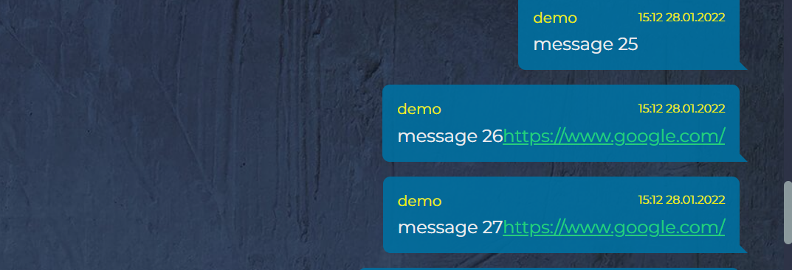
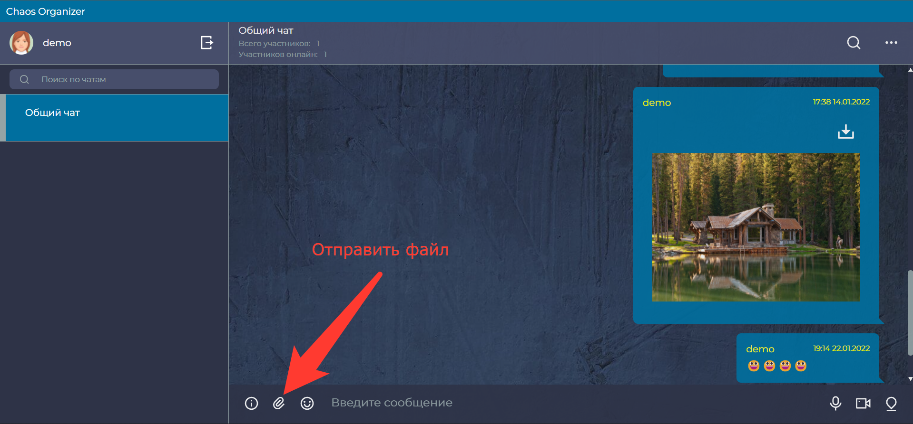
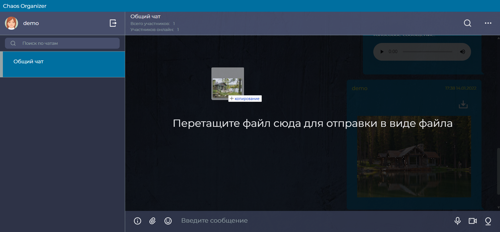
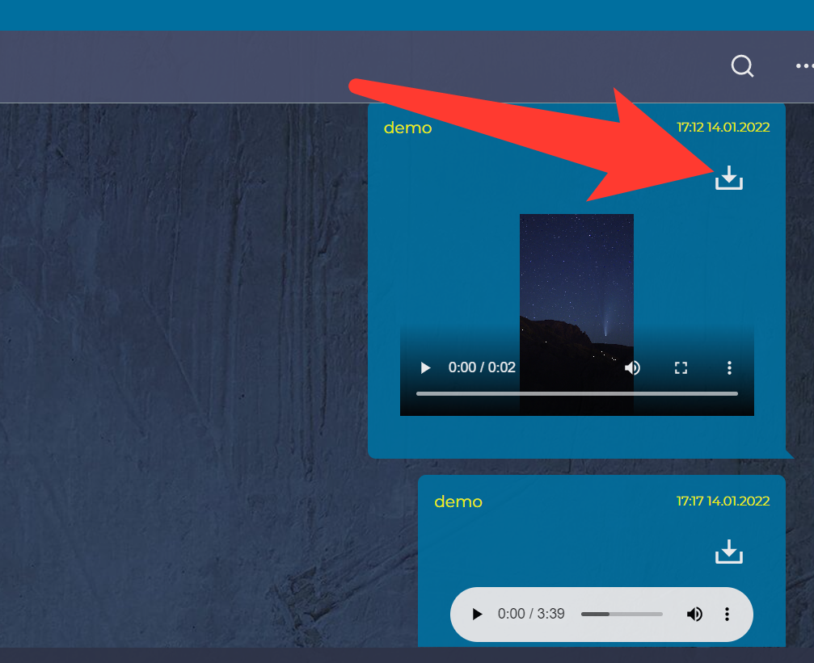
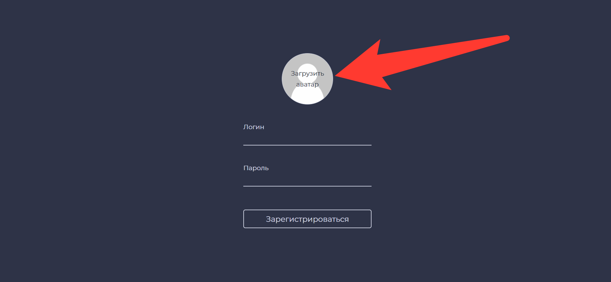
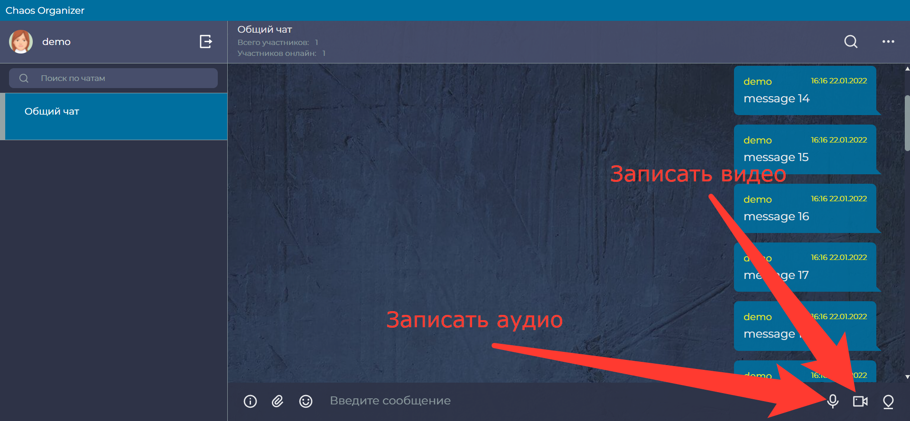
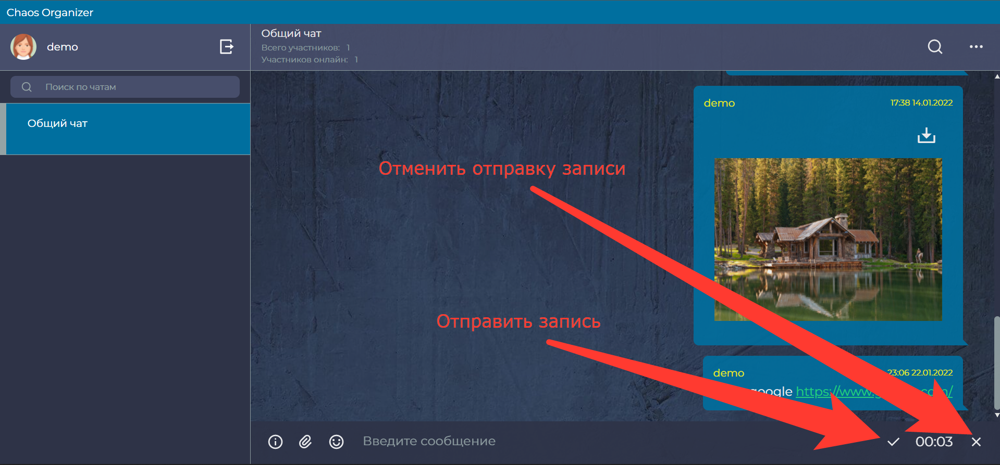
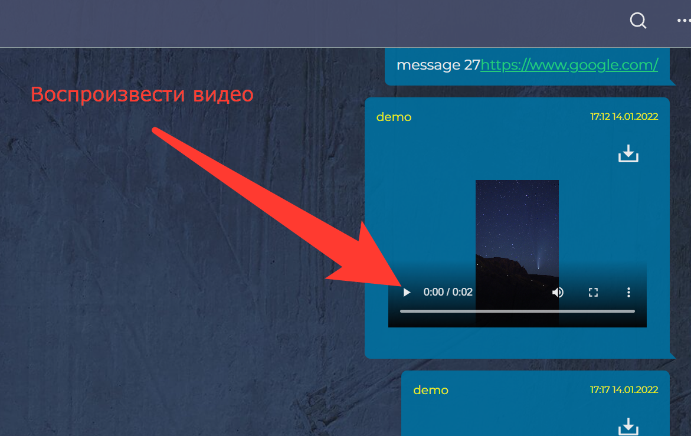
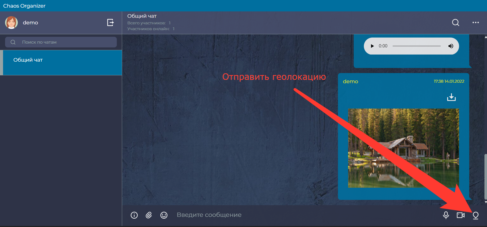
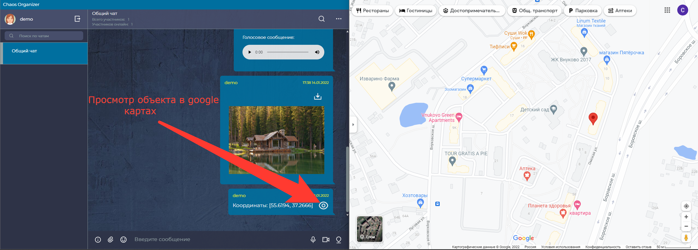

Демо: [https://asasxa.github.io/ahj_dip_front/](https://asasxa.github.io/ahj_dip_front/)

## Реализованные функции

### Обязательные для реализации функции (5/5)

* Сохранение в истории ссылок и текстовых сообщений

* Ссылки (то, что начинается с `http://` или `https://`) должны быть кликабельны и отображаться как ссылки

---

* Сохранение в истории изображений, видео и аудио (как файлов), с отображением превью файла - через Drag & Drop и через иконку загрузки (скрепка в большинстве мессенджеров). 

Загрузка файла при помощи иконки загрузки:

Загрузка файла при помощи Drag & Drop:

---

* Скачивание файлов (на компьютер пользователя)

---
* Ленивая подгрузка: сначала подгружаются последние 10 сообщений, при прокрутке вверх подгружаются следующие 10 и т.д.

---
### Дополнительные для реализации функции

* Авторизация/регистрация - при первом открытии приложения будет предложено авторизоваться или зарегистрироваться. Чтобы авторизоваться необходимо ввести свой логин и пароль и нажать кнопку `войти`. Изначально доступен один пользователь - логин: `demo`, пароль: `demo`. При успешной авторизации произойдет вход. При ошибке авторизации будет показано уведомление об ошибке. Для регистрации необходимо нажать кнопку `регистрация`, затем ввести новый логин и придуманный пароль и нажать кнопку `зарегестрироваться`. Для выхода из аккаунта необходимо нажать кнопку `выход`

* Возможность загрузки аватара при регистрации. Для загрузки аватара необходимо нажать на иконку `загрузить аватар` (см. рисунок ниже). Откроется стандартное окно выбора файлов. Выберите необходимый файл. После выбора изображения появится превью аватара (см. рисунок ниже).

* Синхронизация - если приложение открыто в нескольких окнах (вкладках) или с разных устройств, то контент будет синхронизироваться.

* Запись видео и аудио (используя API браузера). Для записи видео или аудио нужно нажать соответствующую иконку (см. рисунок ниже), после этого начнется запись и будет отображен таймер. При записи видео оно дублируется над полем ввода. Для остановки и отправки записи необходимо нажать на иконку слева от таймера, для отмены записи нужно нажать на иконку справа от таймера.

Начать запись:

Отправить или отменить запись:

* Воспроизведение видео/аудио (используя API браузера)

* Отправка геолокации и просмотр объекта в отдельном окне браузера в google картах при клике на кнопку.

---

* Статус пользователя - если пользователь онлайн, то его аватар помечен маркером (зеленый кружок) у всех участников чата, если пользователь нажал кнопку "выход" маркер изчезает у всех пользователей.

* Просмотр вложений по категориям, например: аудио, видео, изображения, другие файлы (см. боковую меню Telegram)

* Поиск по сообщениям (интерфейс + реализация на сервере). Поиск осуществляется по тексту сообщения

* Поддержка смайликов (emoji)

* Отправка зашифрованных сообщений и файлов (привет crypto-js!) с просмотром расшированных (для этого нужно ввести пароль) - важно эта функция засчитывается за две.

Для того чтобы отправить зашифрованное сообщение необходимо нажать на соответствующую пиктограмму (см. рисунок ниже)

Далее будет предложено придумать пароль для расшифровки сообщения, после того как пароль будет введен и нажата кнопка `сохранить`, пиктограмма станет красного цвета и следующее отправленное текстовое сообщение или файл будут зашифрованны. Для расшифровки сообщения необходимо нажать на соответствующую пиктограмму на самом сообщении и ввести пароль. Каждый пароль действует для одного сообщения, отправленного после сохранения пароля. 

Отправка зашифрованного сообщения:

Отправка зашифрованного файла:

* Отправка команд боту, например: @chaos: погода, бот должен отвечать прогноз погоды (интеграция с реальными сервисами)

Для того чтобы получить информацию о доступных командах, необходимо нажать на соответствующую пиктограмму (см. рисунок ниже)

